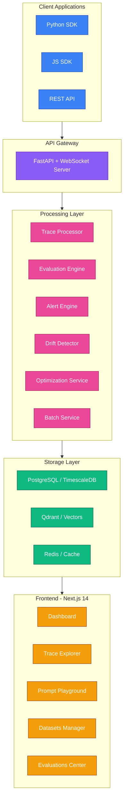
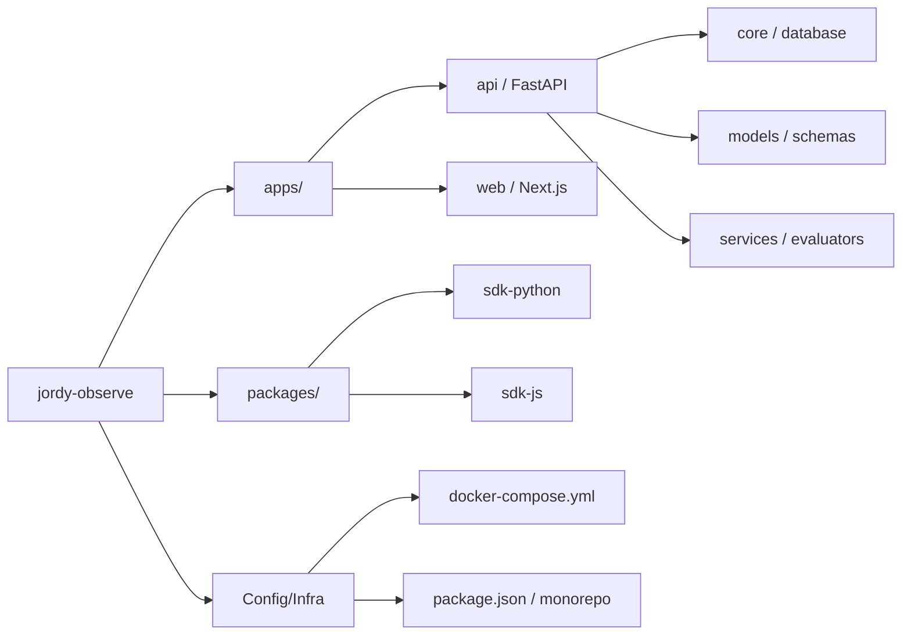

# Jordy Observe: Enterprise AI Observability & Agent Engineering Platform

> Open-source alternative to Arize AI for developing, monitoring, evaluating, and improving AI models and LLM applications in production.

[](LICENSE)
[](https://python.org)
[](https://nextjs.org)

## 🎯 Overview

**Jordy Observe** is an enterprise-grade AI observability platform that provides comprehensive tools for:

- **Distributed Tracing** - Capture and visualize LLM calls, tool invocations, and agent workflows
- **LLM Evaluation** - Built-in evaluators for hallucination, toxicity, relevance, and more
- **Drift Detection** - Monitor data and concept drift in production
- **Prompt Engineering** - Interactive playground for prompt testing and optimization
- **Real-time Monitoring** - Live dashboards with WebSocket updates
- **Auto-Healing** - Automatic prompt optimization for failing traces

## 🏗️ Architecture



## 🚀 Quick Start

### Prerequisites
- Docker & Docker Compose
- Node.js 18+
- Python 3.11+

### 1. Clone and Setup
```bash
git clone https://github.com/your-org/jordy-observe.git
cd jordy-observe
```

### 2. Start Infrastructure
```bash
docker-compose up -d
```

### 3. Install Dependencies
```bash
# Backend
cd apps/api
pip install -r requirements.txt

# Frontend
cd ../web
npm install
```

### 4. Run Migrations
```bash
cd apps/api
alembic upgrade head
python seed.py
```

### 5. Start Services
```bash
# Terminal 1: Backend
cd apps/api
uvicorn app:app --reload --port 8000

# Terminal 2: Frontend
cd apps/web
npm run dev
```

### 6. Access Dashboard
Open http://localhost:3000

## 📦 Project Structure



## ✨ Core Features

- **🔍 Distributed Tracing**: Advanced ingestion engine that handles hierarchical spans, automated latency calculation, and token/cost estimation.
- **📊 LLM Evaluation Engine**: A pluggable system with built-in evaluators for Hallucination, Relevance, and Toxicity detection.
- **🔔 Monitoring & Alerting**: A robust `AlertEngine` that monitors real-time metrics (P95 latency, error rates) and dispatches notifications via a unified `NotificationService`.
- **🌐 Modern Web Dashboard**: A premium Next.js 14 application featuring:
  - **Waterfall Trace Visualization**: Custom `FlameChart` for debugging complex agent workflows.
  - **Performance Metrics**: Real-time cards for volume, latency, and success rates.
  - **Evaluation Center**: High-fidelity `EvaluationCard` components for AI quality scores.
  - **State-of-the-Art Design**: Glassmorphism, blurred background effects, and a custom Sidebar navigation.
- **📈 Advanced Analytics & Vector Search**: Dedicated services for metric aggregation and Qdrant integration for semantic trace analysis.
- **🐍 Python SDK**: A developer-friendly SDK featuring hierarchical context managers and automated trace capture.

## 📦 Key Components Created

| Category | Key Files Implementation |
| :--- | :--- |
| **Core API** | `models.py` (Multi-tenant schema), `trace_processor.py`, `evaluation_service.py` |
| **Services** | `drift_detector.py` (PSI/KS-Stats), `alert_engine.py`, `auto_healing.py` |
| **Frontend** | `FlameChart.tsx`, `EvaluationCard.tsx`, `Sidebar.tsx`, `TraceList.tsx` |
| **SDK** | `packages/sdk-python/jordy_observe/client.py` (Complete tracing SDK) |
| **Infrastructure** | `docker-compose.yml`, `package.json` (Turbo configuration) |

## 🚀 Getting Started

To get the system running:

1. **Infrastructure**: Start the stack with `docker-compose up -d` (Postgres, Redis, Qdrant).
2. **Backend**: `cd apps/api`, install `requirements.txt`, and run `python seed.py` to populate the initial dashboard.
3. **Frontend**: `cd apps/web`, `npm install` and `npm run dev`.
4. **SDK Demo**: Run `python demo_sdk_usage.py` to see live tracing in action.

## 🐍 Python SDK Usage

```python
from jordy_observe import JordyClient

# Initialize client
client = JordyClient(api_key="your-api-key")

# Trace an agent workflow
with client.trace("RAG Agent") as trace:
    # Retrieval step
    with trace.span("knowledge_retrieval", span_type="retrieval") as span:
        span.log_input({"query": "What is the stock price?"})
        documents = retrieve_docs(query)
        span.log_output({"documents": documents})
    
    # LLM generation step
    with trace.span("llm_generation", span_type="llm") as span:
        span.log_input({"prompt": prompt, "context": documents})
        response = llm.generate(prompt)
        span.log_output({"response": response})

print("Trace sent successfully!")
```

## 🌐 JavaScript SDK Usage

```javascript
import { JordyClient } from '@jordy/observe';

const client = new JordyClient({ apiKey: 'your-api-key' });

const trace = client.startTrace('Chat Agent');

const span = trace.startSpan('llm_call', { type: 'llm' });
span.logInput({ prompt: 'Hello, world!' });
// ... your LLM call
span.logOutput({ response: 'Hi there!' });
span.end();

await trace.end();
```

## 🔑 API Reference

### Traces
```
POST   /api/v1/traces              # Ingest new trace
GET    /api/v1/traces/{id}         # Get trace details
GET    /api/v1/traces/{id}/spans   # Get trace spans
GET    /api/v1/traces/{id}/evals   # Get evaluations
```

### Datasets
```
POST   /api/v1/datasets            # Create dataset
GET    /api/v1/datasets            # List datasets
POST   /api/v1/datasets/{id}/items # Add items
GET    /api/v1/datasets/{id}/export # Export JSONL
```

### Prompts
```
POST   /api/v1/prompts             # Create prompt
POST   /api/v1/prompts/{id}/versions # Add version
POST   /api/v1/prompts/optimize    # Auto-optimize
POST   /api/v1/prompts/benchmark   # A/B benchmark
```

## 🛠️ Technology Stack

| Layer | Technology |
|-------|------------|
| **Frontend** | Next.js 14, React 18, TypeScript, Tailwind CSS |
| **Backend** | FastAPI, Python 3.11+, SQLAlchemy 2.0 |
| **Database** | PostgreSQL 16 / TimescaleDB |
| **Vector Store** | Qdrant (HNSW indexed) |
| **Cache/Queue** | Redis |
| **Real-time** | WebSockets |

## 📄 License

MIT License - see [LICENSE](LICENSE) for details.

## 🤝 Contributing

Contributions are welcome! Please read our [Contributing Guide](CONTRIBUTING.md).
