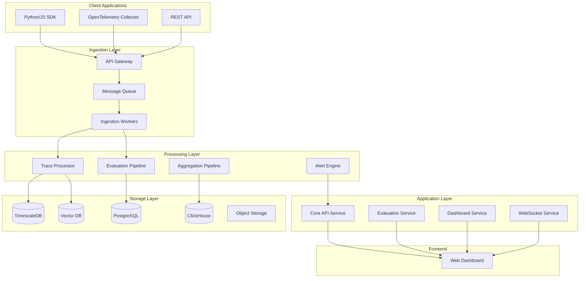

# Jordy Observe: Enterprise AI Observability & Agent Engineering Platform

> A full-featured AI observability platform for developing, monitoring, evaluating, and improving AI models and LLM applications in production.

## Executive Summary

**Jordy Observe** is an enterprise-grade AI observability platform inspired by Arize AI. It provides comprehensive tools for monitoring AI/LLM applications, evaluating model performance, debugging agent workflows, and enabling continuous improvement through data-driven insights.

---

## User Review Required

> [!IMPORTANT]
> **Technology Stack Decisions**: Please confirm the following technology choices:
> - **Backend**: Python (FastAPI) + Node.js (WebSocket services)
> - **Database**: PostgreSQL + TimescaleDB (time-series) + ClickHouse (analytics)
> - **Frontend**: Next.js 14 with React + TypeScript
> - **Message Queue**: Redis Streams or Apache Kafka
> - **Vector DB**: Qdrant or Milvus for embedding storage

> [!WARNING]
> **Scope & Timeline**: This is a comprehensive platform with 9 major phases. Full implementation could take 3-6 months. We can:
> 1. **Full Build**: Implement all features end-to-end
> 2. **MVP First**: Start with core observability (tracing + basic evaluation)
> 3. **Phased Approach**: Deliver incrementally with working features each phase

---

## System Architecture



---

## Proposed Changes

### Phase 1: Project Foundation & Infrastructure

#### [NEW] Project Structure
```
jordy-observe/
├── apps/
│   ├── api/                    # FastAPI backend
│   ├── web/                    # Next.js frontend
│   ├── workers/                # Background workers
│   └── docs/                   # Documentation site
├── packages/
│   ├── sdk-python/             # Python SDK
│   ├── sdk-js/                 # JavaScript SDK
│   ├── shared/                 # Shared utilities
│   └── ui-components/          # React component library
├── infrastructure/
│   ├── docker/                 # Docker configurations
│   ├── k8s/                    # Kubernetes manifests
│   └── terraform/              # Infrastructure as Code
├── scripts/                    # Build & deployment scripts
├── docker-compose.yml
├── package.json
└── README.md
```

---

### Phase 2: Core Backend Services

#### [NEW] [apps/api/](file:///c:/Users/v-thanvu/.gemini/antigravity/playground/tidal-expanse/apps/api/)

Core FastAPI application with the following modules:

| Module | Purpose |
|--------|---------|
| `traces/` | Trace ingestion ، storage, and retrieval |
| `spans/` | Individual span management |
| `projects/` | Multi-tenant project management |
| `evaluations/` | LLM evaluation engine |
| `experiments/` | A/B testing & experiments |
| `alerts/` | Monitoring & alerting system |
| `datasets/` | Dataset management for evaluation |
| `auth/` | Authentication & authorization |

**Key API Endpoints:**
```
POST   /api/v1/traces           # Ingest traces
GET    /api/v1/traces/{id}      # Retrieve trace details
POST   /api/v1/evaluations/run  # Run evaluation
GET    /api/v1/projects/{id}/metrics  # Project metrics
POST   /api/v1/experiments      # Create experiment
WS     /ws/traces               # Real-time trace streaming
```

---

### Phase 3: Observability Engine

#### [NEW] [apps/api/services/trace_processor.py](file:///c:/Users/v-thanvu/.gemini/antigravity/playground/tidal-expanse/apps/api/services/trace_processor.py)

Trace processing pipeline:
- **Span Collection**: Capture LLM calls, tool invocations, retrieval steps
- **Trace Assembly**: Link spans into complete execution traces
- **Metrics Extraction**: Latency, token usage, cost calculation
- **Embedding Storage**: Store embeddings for semantic analysis

#### [NEW] [apps/api/services/drift_detector.py](file:///c:/Users/v-thanvu/.gemini/antigravity/playground/tidal-expanse/apps/api/services/drift_detector.py)

Drift detection algorithms:
- Distribution shift detection (KL divergence, PSI)
- Embedding drift using cosine similarity
- Feature importance monitoring
- Automated threshold calculation

---

### Phase 4: LLM Evaluation Module

#### [NEW] [apps/api/evaluators/](file:///c:/Users/v-thanvu/.gemini/antigravity/playground/tidal-expanse/apps/api/evaluators/)

Built-in evaluators:

| Evaluator | Description |
|-----------|-------------|
| `HallucinationEvaluator` | Detects hallucinated content in responses |
| `RelevanceEvaluator` | Scores response relevance to query |
| `ToxicityEvaluator` | Identifies harmful/toxic content |
| `QACorrectnessEvaluator` | Validates Q&A accuracy |
| `SQLEvaluator` | Validates SQL generation |
| `CodeEvaluator` | Evaluates code generation quality |
| `SummarizationEvaluator` | Scores summary quality |
| `CustomEvaluator` | User-defined evaluation templates |

**LLM-as-a-Judge Implementation:**
```python
class LLMJudgeEvaluator:
    def evaluate(self, input: str, output: str, context: str) -> EvaluationResult:
        # Uses configurable LLM (GPT-4, Claude, etc.)
        # Returns score, explanation, and metadata
```

---

### Phase 5: Agent Engineering Tools

#### [NEW] [apps/web/app/playground/](file:///c:/Users/v-thanvu/.gemini/antigravity/playground/tidal-expanse/apps/web/app/playground/)

Prompt Playground features:
- Interactive prompt editor with syntax highlighting
- Variable injection and templating
- Side-by-side comparison of prompt versions
- Real-time evaluation results
- Version history and rollback

#### [NEW] [apps/api/services/experiment_engine.py](file:///c:/Users/v-thanvu/.gemini/antigravity/playground/tidal-expanse/apps/api/services/experiment_engine.py)

Experiment tracking:
- A/B testing for prompts and models
- Statistical significance calculation
- Variant comparison dashboards
- Automatic winner selection

---

### Phase 6: Monitoring & Alerting

#### [NEW] [apps/api/services/alert_engine.py](file:///c:/Users/v-thanvu/.gemini/antigravity/playground/tidal-expanse/apps/api/services/alert_engine.py)

Alert types:
- **Performance Alerts**: Latency degradation, error rate spikes
- **Drift Alerts**: Data/concept drift detected
- **Quality Alerts**: Evaluation score drops
- **Cost Alerts**: Token usage exceeds threshold
- **Custom Alerts**: User-defined conditions

Notification channels: Email, Slack, PagerDuty, Webhooks

---

### Phase 7: Web Dashboard

#### [NEW] [apps/web/](file:///c:/Users/v-thanvu/.gemini/antigravity/playground/tidal-expanse/apps/web/)

Dashboard modules:

````carousel
**Trace Explorer**
- Hierarchical trace tree visualization
- Span details panel with inputs/outputs
- Token usage and latency breakdown
- Filter by model, status, time range

<!-- slide -->

**Metrics Dashboard**
- Real-time request volume charts
- Latency percentiles (p50, p95, p99)
- Error rate trends
- Cost tracking by model/project

<!-- slide -->

**Evaluation Center**
- Run evaluations on datasets
- View evaluation results and distributions
- Compare model/prompt performance
- Export evaluation reports

<!-- slide -->

**Prompt Playground**
- Interactive prompt IDE
- Variable management
- A/B version comparison
- Real-time testing
````

---

### Phase 8: SDKs & Integrations

#### [NEW] [packages/sdk-python/](file:///c:/Users/v-thanvu/.gemini/antigravity/playground/tidal-expanse/packages/sdk-python/)

Python SDK features:
```python
from jordy_observe import JordyObserve

# Initialize
jo = JordyObserve(api_key="...")

# Automatic instrumentation
jo.instrument(openai=True, langchain=True)

# Manual tracing
with jo.trace("my-agent") as trace:
    with trace.span("llm-call") as span:
        response = openai.chat(...)
        span.set_output(response)
```

#### OpenTelemetry Integration
- Custom exporters for trace data
- Semantic conventions for LLM spans
- Compatible with existing OTEL infrastructure

---

## Technology Stack Summary

| Layer | Technology | Purpose |
|-------|------------|---------|
| **Frontend** | Next.js 14, React 18, TypeScript | Web dashboard |
| **Styling** | Tailwind CSS, Radix UI | UI components |
| **Backend** | FastAPI (Python 3.11+) | REST API |
| **Real-time** | WebSockets, Redis Pub/Sub | Live updates |
| **Database** | PostgreSQL 16 | Primary data store |
| **Time-series** | TimescaleDB | Metrics storage |
| **Analytics** | ClickHouse | OLAP queries |
| **Vector DB** | Qdrant | Embedding storage |
| **Queue** | Redis Streams | Message processing |
| **Cache** | Redis | Caching layer |
| **Search** | Elasticsearch | Full-text search |
| **Object Store** | MinIO / S3 | File storage |

---

## Database Schema (Key Tables)

```sql
-- Projects
CREATE TABLE projects (
    id UUID PRIMARY KEY,
    name VARCHAR(255) NOT NULL,
    api_key VARCHAR(64) UNIQUE,
    created_at TIMESTAMPTZ DEFAULT NOW()
);

-- Traces
CREATE TABLE traces (
    id UUID PRIMARY KEY,
    project_id UUID REFERENCES projects(id),
    session_id VARCHAR(255),
    user_id VARCHAR(255),
    start_time TIMESTAMPTZ NOT NULL,
    end_time TIMESTAMPTZ,
    status VARCHAR(20),
    metadata JSONB
);

-- Spans
CREATE TABLE spans (
    id UUID PRIMARY KEY,
    trace_id UUID REFERENCES traces(id),
    parent_span_id UUID,
    name VARCHAR(255),
    span_type VARCHAR(50), -- 'llm', 'tool', 'retrieval', 'agent'
    input JSONB,
    output JSONB,
    start_time TIMESTAMPTZ,
    end_time TIMESTAMPTZ,
    attributes JSONB,
    events JSONB[]
);

-- Evaluations
CREATE TABLE evaluations (
    id UUID PRIMARY KEY,
    trace_id UUID REFERENCES traces(id),
    span_id UUID REFERENCES spans(id),
    evaluator_name VARCHAR(100),
    score FLOAT,
    label VARCHAR(50),
    explanation TEXT,
    created_at TIMESTAMPTZ DEFAULT NOW()
);
```

---

## Verification Plan

### Automated Tests

#### Unit Tests
```bash
# Backend tests
cd apps/api
pytest tests/ -v --cov=app --cov-report=html

# Frontend tests
cd apps/web
npm run test
```

#### Integration Tests
```bash
# API integration tests
pytest tests/integration/ -v

# E2E browser tests
cd apps/web
npx playwright test
```

#### Load Testing
```bash
# Trace ingestion performance
k6 run tests/load/trace_ingestion.js
```

### Manual Verification

1. **Trace Ingestion Flow**
   - Use Python SDK to send sample traces
   - Verify traces appear in dashboard
   - Confirm span hierarchy is correct

2. **Evaluation Pipeline**
   - Create a dataset with known inputs/outputs
   - Run hallucination evaluator
   - Verify scores match expected results

3. **Real-time Updates**
   - Open dashboard in browser
   - Send new traces via SDK
   - Confirm traces appear within 2 seconds

4. **Alert System**
   - Configure latency alert (threshold: 1000ms)
   - Send slow traces (>1000ms)
   - Verify alert notification received

---

## Implementation Phases & Timeline

| Phase | Description | Estimated Duration |
|-------|-------------|-------------------|
| 1 | Project Setup & Infrastructure | 3-4 days |
| 2 | Core Backend (API + DB) | 5-7 days |
| 3 | Observability Engine | 5-7 days |
| 4 | LLM Evaluation Module | 5-7 days |
| 5 | Agent Engineering Tools | 4-5 days |
| 6 | Monitoring & Alerting | 3-4 days |
| 7 | Web Dashboard | 7-10 days |
| 8 | SDKs & Integrations | 4-5 days |
| 9 | Testing & Documentation | 3-4 days |

**Total Estimated: 6-8 weeks** (focused development)

---

## Key Differentiators

1. **Open Standards First**: Built on OpenTelemetry for maximum compatibility
2. **Self-Hostable**: Full control over data with Docker/Kubernetes deployment
3. **Extensible Evaluators**: Plugin architecture for custom evaluation logic
4. **Real-time by Default**: WebSocket-based live updates throughout
5. **Developer Experience**: First-class SDK support with minimal setup

---


